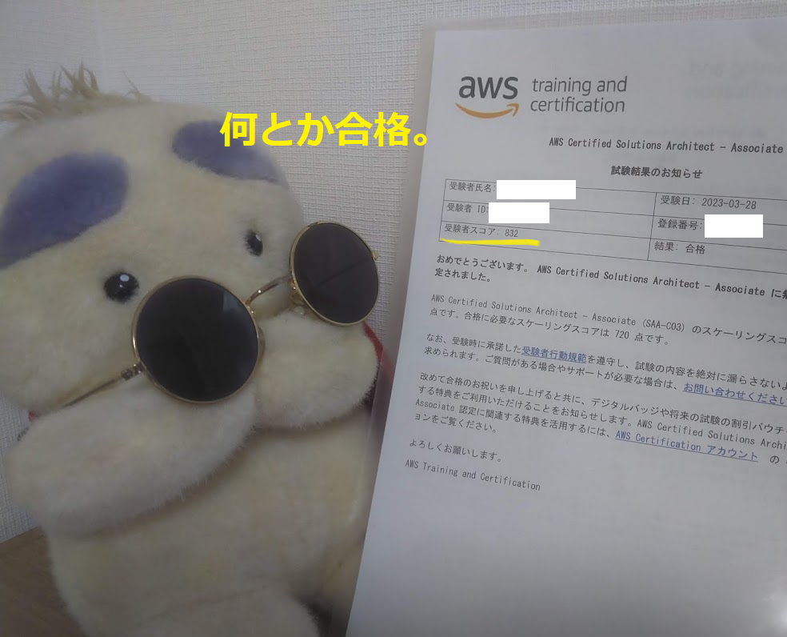

## AWSソリューションアーキテクトアソシエイツ取得までの取組み

久々の資格試験、学習ルーティーンなどがなかなか確立できず苦戦しました。  何を取り組んだのかまとめておきます。
---

## 受験者（私）のAWS学習歴

正直なところ、AWSにがっつり触れているわけではないです。他の人よりは詳しいくらい。

* 会社の仕事でAWSはほぼ使わない
* 会社の委員会活動（技術委員）でAWSの調査を少々
* 2年半くらい前に AWSクラウドプラクティショナー に合格

2年前の合格記事はこちら：

[【合格しました】AWSクラウドプラクティショナーまとめ](https://mosomoso-history.com/)

---

## 試験対策内容：期間は半年・所要時間は42時間ほど

仕事が忙しく、初めのうちはほとんど時間を取れず……  1か月に1回くらい Udemy 講座を受講するくらいでした（しかも途中まで）。

集中して時間を取れるならば、もっと短い学習時間で合格できるでしょう。

---

## Udemy講座・ハンズオン（約15時間）

受講した講座：

[【SAA-C03版】これだけでOK！ AWS 認定ソリューションアーキテクト – アソシエイト試験突破講座](https://www.udemy.com)

実際に AWS 上のサービスを使いつつ学習していくスタイル。

AWS を触ったことがない人には、こういったハンズオンはとてもおすすめです。

私は 2 回ほどハンズオンなしで閲覧して内容を確認し、  ハンズオンは途中まで実施して止まっています（まとまった時間が取れず無念）。

---

## AWS試験対策本（約3時間）

基礎を押さえるため、試験対策本は必須です。  今回使用した教材：

**「AWS認定ソリューションアーキテクト［アソシエイト］ AWS認定資格試験テキスト」**

今回は時間がなく 1 回通読するしかできませんでしたが、  時間があればみっちり読むことを勧めます。

クラウドプラクティショナー受験時の活用方法：

1. 一通り読んで理解する（1回目）
2. 理解しながら読む＋理解が浅い所は AWS を実際に動かす（2回目）
3. 試験前に重要ポイントだけ読む（3回目）

---

## Ping-t 最強Web問題集（約15時間）

Ping-t というサービスをご存じでしょうか？

[Ping-t](https://ping-t.com)

AWS、CCNA、LinuC などの問題を大量に解ける Web サイトです。  私は CCNA を取得する際にもお世話になりました。

AWS も 500 問以上あるので、  ひととおり正解するまでひたすら問題を解きました。

通勤時、昼休みにスマホでポチポチ……  スマホの通信量が 1GB ほどこれで使っていたようです。

数をこなして苦手分野をつぶすには最適ですし、  「数をこなした」という自信にもつながります。

---

## Udemy模擬試験（約9時間）

本番試験の数日前に最後のまとめとして取り組みました。

受講した講座：

[【SAA-C03版】AWS認定ソリューションアーキテクト アソシエイト模擬試験問題集（6回分390問）](https://www.udemy.com)

1回の試験が2時間、見直し含めると3時間ほど。  それが6回分なので、これだけでかなりの学習量になります。

私は時間がなく（試験3日前から開始）、  4回分だけしか行えませんでした。

しかも模擬試験の結果は4回とも不合格。

この状態で試験に臨むことになり、不安しかなかったです。  もっと早めに取り組むことを強くおすすめします。

「模擬試験で間違ったところは二度と間違うまい！」  という気持ちで見直しをしたことが、結果的には良かったのだと思います。

---

## 受験結果：合格（832点）

結果は **832点で合格** でした。  最後まであきらめなくてよかったです。

ひととおり試験問題を解き終わっても、  もう一回すべての問題を見直しました。

AWS のサービスの特徴をしっかり理解し、  問題で問われているシナリオに合致するソリューションを選択することがポイントです。

知識もさることながら、国語力が必要ですね。  難度が高くなるにつれ国語力が必要になる点は、情報処理技術者試験にも通じます。

---

## 心のお守り：再受験無料キャンペーン

私がなんとか今年度中に受験に踏み切れたのは、  再受験無料キャンペーンが開催されていたからです。

[https://www.pearsonvue.co.jp/aws/retake](https://www.pearsonvue.co.jp/aws/retake)

もし不合格だったとしても、1回だけ無料で受験できるキャンペーンです。

もちろん合格を目指して最後まで粘りますが、  落ちた時も再受験できると考えると心の安定につながります。

こういったキャンペーン情報も、資格試験を目指す人には要チェックだと思います。

---

## まとめ

1. AWSソリューションアーキテクトアソシエイツに合格しました（学習時間42時間ほど）
2. 学習方法は
   * ハンズオン
   * 本
   * Ping-t
   * 模擬試験
3. 学習準備は十分とは言えませんでしたが、  再受験無料キャンペーンの後押しもあり、心の余裕をもってチャレンジできました。

これでクラウド関連資格の中級資格を初めて1つ取得できました。  次は Azure の中級資格を目指そうと思います。

[def]: ../../../../public/Blog/image/20230402_aws-saa-exam.png